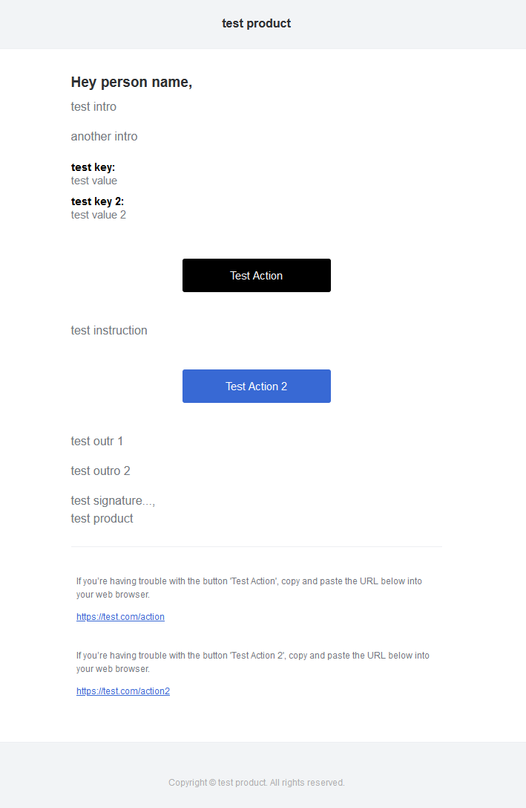

# mailgen

[](https://crates.io/crates/mailgen)
[](https://docs.rs/mailgen)
[](LICENSE)

This crate allows you to generate pretty emails without all the hassle.

Inspired by the node.js package [mailgen](https://github.com/eladnava/mailgen).

# Examples

```rust
use mailgen::themes::DefaultTheme;
use mailgen::{Action, Branding, EmailBuilder, Greeting, Mailgen};

let theme = DefaultTheme::new();
let branding = Branding::new("test product", "https://testproduct.com");
let mailgen = Mailgen::new(&theme, branding);

let email = EmailBuilder::default()
    .greeting(Greeting::Name("person name"))
    .intro("test intro")
    .intro("another intro")
    .dictionary("test key", "test value")
    .dictionary("test key 2", "test value 2")
    .action(Action {
            text: "Test Action",
        link: "https://test.com/action",
        color: Some(("black", "white")),
        ..Default::default()
    })
    .action(Action {
            text: "Test Action 2",
        link: "https://test.com/action2",
        instructions: Some("test instruction"),
        ..Default::default()
    })
    .outro("test outr 1")
    .outro("test outro 2")
    .signature("test signature...")
    .build();

let rendered = mailgen.render_text(&email)?;
std::fs::write("./email.txt", &rendered)?;

let rendered = mailgen.render_html(&email)?;
std::fs::write("./email.html", &rendered)?;
```


